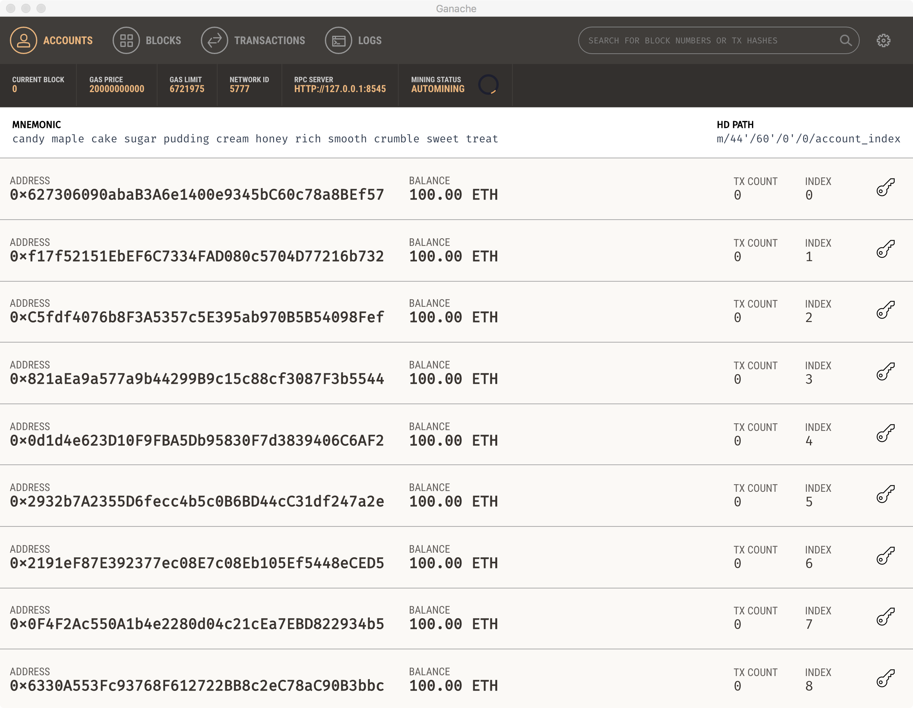

# dMarket (dApp)
## decentralized MarketPlace Demo


Market is a distributed application (dApp) that leverages the Ethereum network and smart contracts to exchange ERC20, minted tokens, for goods and services within the network. A hybrid application is built on top with a web3 class to manipulate the chain as well as integrating biometric plugins to enable smart contracts to one signed on the device with the user’s private key. This project is meant to act as a case study the usecase of blockchain, ethereum, smart contracts and ipfs as a meaningful and reliable platforms. 

## Structure

dMarktet has two major moving parts that need to be running to ensure that dApp responds in the appropriate way. The first part would be ionic application is the end user client that would primaly talk to the ethereum network. The second portion is listener/indexer which is will save certain information off the chain for the application user experience like product search.

## Prerequisites

- <a href="https://github.com/trufflesuite/ganache">Ganache</a>
- <a href="https://ionicframework.com/">Ionic Framework v2</a>
- <a href="https://www.npmjs.com/">npm</a>
- <a href="https://nodejs.org/en/">Node.js</a>
- <a href="https://docs.mongodb.com/manual/installation/">MongoDB</a>

## Building

Install the dependencies in the root directory:

```
npm install
```
Starts the ethereum local test network via the Ganache client:



In a seperate terminal start a mongodb session:

```
mongod --dbpath .
```

Deploy the ERC20 coin contract to the local ethereum in root directory:

```
node deploycoin.js
```
Ensure the contract address matches in the address in the config.ts file. Next the indexer which will be listening to the smart contract events needs to be started:

```
node indexing.js
```
Lastly, launch the ionic application:

```
ionic serve
```


